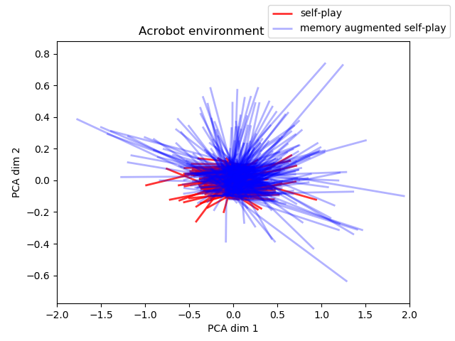

# Memory Augmented Self-Play

[Self-play](https://arxiv.org/abs/1703.05407) is an unsupervised training procedure which enables the reinforcement learning agents to explore the environment without requiring any external rewards. We augment the self-play setting by providing an external memory where the agent can store experience from the previous tasks. This enables the agent to come up with more diverse self-play tasks resulting in faster exploration of the environment. The agent pretrained in the memory augmented self-play setting easily outperforms the agent pretrained in no-memory self-play setting.

## Paper

* [Arxiv](https://arxiv.org/abs/1805.11016) [Submitted to ICML Workshop]

## Setup

* Install requirements using `pip install -r SelfPlay/requirements.txt`.
* copy `SelfPlay/config/config.cfg.sample` to `Selfplay/config/config.cfg` and update parameters as required
* `cd SelfPlay` and run `./test.sh`
* Refer `SelfPlay/test.sh` to see the different scripts that are supported.

## Results


For the mazebase task, the trend of current reward (computed as a running average over last 10000 episodes) in target task with the number of episodes is shown in Figure 1. The key observation is that **memory augmented self-play** consistently performs better than both **self-play** and no self-play setting. Even though all the models converge towards the same reward value, using **memory augmented self-play** increases the speed of convergence. All the curves were plotted using the average value after running the models for 5 different seeds. We also observe that **self-play** (without memory) performs better than the no self-play setting. This was observed in the **self-play** paper and our experiments validate that observation.


**Figure 1: Comparison of different approaches on Mazebase task**

For the Acrobot task, we observe that the memory augmented agent performs the best. Even though both the self-play and no self-play variants perform poorly, the no-selfplay version is slightly better. One of our motivations behind adding memory was that having an explicit memory would allow Alice to remember what states she has already visited. This would enable her to explore more parts of the environment as compared to the **self-play** setting. To validate this hypothesis, we perform a simple analysis. We compile the list of all the start and the end states that Alice encounters during training. Even though the start states are chosen randomly, the end states are determined by the actions she takes. We embed all the states into a 2-dimensional space using PCA and plot the line segments connecting the start and the end states for each episode. The resulting plot is shown in Figure 2. We observe that using LSTM memory results in a wider distribution of end state points as compared to the case of **self-play** with no memory. The mean euclidean distance between start and end points (in PCA space) increases from 0.0192 (**self-play** without memory) to 0.1079 (**memory augmented self-play**), a 5x improvement. This affirms our hypothesis that **memory augmented self-play** enables Alice to explore more parts of the environment and enables her to come up with more diverse set of tasks for Bob to train on.




**Figure 2: Plot of start and end states in 2D with and without memory augmentation**

## References

```
@article{sukhbaatar2017intrinsic,
  title={Intrinsic motivation and automatic curricula via asymmetric self-play},
  author={Sukhbaatar, Sainbayar and Lin, Zeming and Kostrikov, Ilya and Synnaeve, Gabriel and Szlam, Arthur and Fergus, Rob},
  journal={arXiv preprint arXiv:1703.05407},
  year={2017}
}
```

